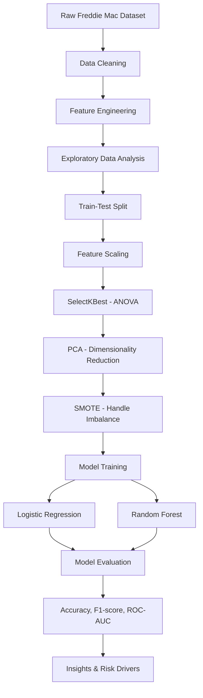

# 🏦 MBS Defaulter Prediction - Financial Risk Modelling


> End-to-end machine learning pipeline for mortgage default risk prediction using real-world financial data.

---

## 🔹 Introduction About the Project

**The goal of this project** is to predict whether a mortgage-backed security (MBS) will become delinquent using borrower and loan-level financial data.

This is a **binary classification problem**, where financial and demographic features are used to identify high-risk loans and support risk management decisions.

---

## 🎯 Objective

* Predict mortgage default (delinquency) using historical loan-level data
* Identify key factors influencing default risk
* Compare performance of different machine learning models
* Evaluate model performance using appropriate classification metrics

---

## 🧩 Project Architecture



---

## 📊 Dataset Information

**The dataset** is sourced from the Freddie Mac loan-level dataset and contains borrower, loan, and repayment information.

Dataset: [https://www.freddiemac.com/research/datasets/sf-loanlevel-dataset](https://www.freddiemac.com/research/datasets/sf-loanlevel-dataset)

### Features in the dataset:

* `CreditScore` : Borrower’s creditworthiness
* `DTI` : Debt-to-Income ratio
* `InterestRate` : Mortgage interest rate
* `LTV` : Loan-to-Value ratio
* `MortgageInsurancePercent` : Insurance on loan
* `NumBorrowers` : Number of borrowers
* `FirstTimeHomebuyer` : Buyer status
* `Channel` : Loan origination channel
* `SellerName` : Loan issuing entity
* `MonthsInRepayment` : Loan repayment duration
* `PrepaymentPenalty` : Penalty flag

👉 **Target variable:**

* `EverDelinquent` (0 = No default, 1 = Default)

---

## ⚙️ Approach for the Project

### 1. Data Preprocessing

* Removed duplicate records
* Handled missing values using median (numerical) and mode (categorical)
* Encoded categorical variables using one-hot encoding
* Scaled numerical features for model compatibility

---

### 2. Feature Engineering

* Created credit score buckets (Poor, Fair, Good, Excellent)
* Converted repayment duration into repayment ranges
* Generated domain-based risk indicators (e.g., high DTI, insurance levels)

---

### 3. Exploratory Data Analysis (EDA)

* Analyzed feature distributions and relationships with target
* Observed higher delinquency for:

  * Poor credit score
  * Longer repayment duration
  * High DTI ratio
* Found weak relationship between LTV and delinquency

---

### 4. Feature Selection

* Applied **SelectKBest using ANOVA F-test**
* Selected top features based on statistical relevance to target
* Reduced noise and improved model interpretability

---

### 5. Dimensionality Reduction

* Applied **Principal Component Analysis (PCA)**
* Retained ~86% variance using reduced feature space
* Addressed multicollinearity and improved model efficiency

---

### 6. Handling Class Imbalance

* Used **SMOTE (Synthetic Minority Oversampling Technique)**
* Balanced the dataset to improve minority class learning

---

### 7. Model Building

* Trained and compared:

  * **Logistic Regression (baseline & interpretable)**
  * **Random Forest (non-linear model)**

---

### 8. Model Evaluation

* Used metrics suitable for imbalanced classification:

  * Accuracy
  * F1-score (weighted)
  * ROC-AUC

---

## 📈 Results

### Model Performance:

* Logistic Regression → Better performance
* Random Forest → Slightly lower performance

👉 **Final Performance (Logistic Regression):**

* Accuracy: **89.32%**
* F1-score: **~0.89 (weighted)**
* ROC-AUC: **~0.95**

✔ Model effectively captured default risk patterns

---

## 📌 Key Insights

* Credit score is a strong predictor of default risk
* Longer repayment duration increases delinquency probability
* High DTI ratio significantly impacts default likelihood
* Multiple borrowers reduce default risk
* PCA improves stability in multicollinear data

---

## 🛠️ Technologies Used

* Python
* Pandas
* NumPy
* Matplotlib / Seaborn
* Scikit-learn
* Imbalanced-learn (SMOTE)

---

## 🚀 How to Run the Project

```bash
pip install pandas numpy matplotlib seaborn scikit-learn imbalanced-learn
```

Run the notebook:

```bash
jupyter notebook
```

---

## 📉 Evaluation Metrics

**F1-score (weighted) & ROC-AUC**

* F1-score balances precision and recall
* ROC-AUC measures model’s ability to distinguish classes
* Suitable for imbalanced classification problems

---

## ⚠️ Limitations

* Synthetic data generation (SMOTE) may introduce noise
* Model relies only on structured financial variables
* External economic factors are not included
* PCA reduces interpretability of transformed features

---

## 🔮 Future Improvements

* Use PR-curve for deeper imbalance evaluation
* Incorporate macroeconomic indicators
* Apply advanced models (XGBoost, LightGBM)
* Perform hyperparameter tuning
* Deploy model using Streamlit / API

---

## 🎤 Project Summary

Developed a mortgage default prediction model using machine learning techniques on large-scale loan data.
After preprocessing, feature engineering, and handling class imbalance, SelectKBest and PCA were applied for feature optimization.
Logistic Regression achieved strong performance with high accuracy, F1-score, and ROC-AUC, effectively identifying key financial risk drivers.

---
